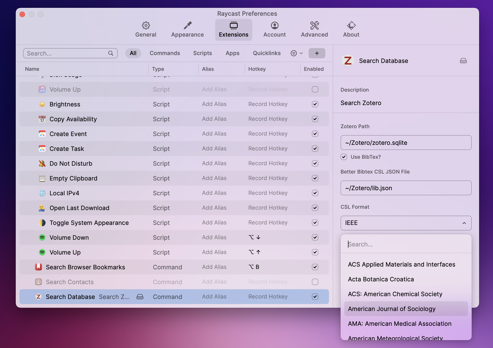
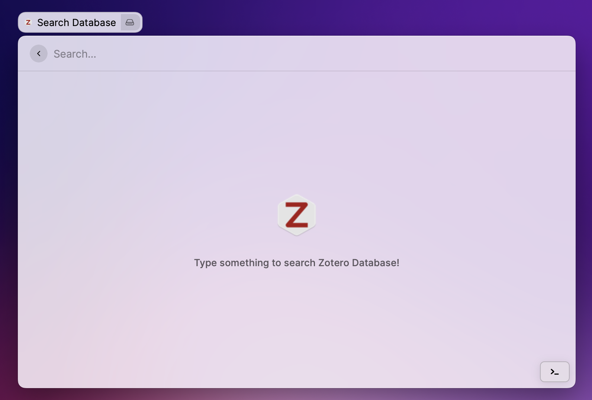

# Raycast Search Zotero

```html
`<font color="#ff0000">`Zotero cache will be updated immediately after any change `</font>`
```

* modify readCache to trigger cache update in any time. The sqlite file modified time will be compared with cache file to decide whether the cache will be updated.
* replace getLatestModifyDate with getLatestModifyDateByFile, so that the operation like deletion will also be captured.

---

This extension brings [Zotero](https://www.zotero.org/) search to raycast!


## Getting started

This extension reads your local zotero sqlite database to enable searching of references.
In order to avoid creating locks for the database, it creates a copy of the sqlite database with
a suffix of `.raycast`.

## Setup

You need to have [Zotero](https://www.zotero.org/) installed. This extension has few optional
preferences:

- **Zotero Sqlite Path**: Location where your Zotero App sqlite files are kept. By default this is located at
  `$HOME/Zotero/zotero.sqlite`. If you are using an alternate location, you will need to update this.

If you use the Better BibTex zotero extension, you can enable few additional features. Additionally,
you can copy the references in certain CSA styles as well as bibtex entries to clipboard or paste
on the most current Application.

Preferences related to these features are:

- **Whether to use Better BibTex Citation**: If you use the [Better BibTex zotero extension](https://retorque.re/zotero-better-bibtex/), you can enable this flag to copy Better BibTex citation keys for any reference.
- **Better Bibtex CSL JSON File**: Path where you save your auto-updating CSL JSON file. **PLEASE
  NOTE THAT THIS IS MUST IF YOU WANT TO USE THESE FEATURES**. Please see the following screencast
  to setup this properly. You will need to update this entry to the path you chose to save this CSL
  JSON file. By default this is setup to be
  `~/Zotero/lib.json`. If you are not saving yours to this location, please ensure to update this.


- **CSL Format**: This is the style with which you want to copy reference text in clipboard or
  paste in frontmost application. Currently following formats are supported. These are based on
  default formats supported by Zotero.

  - ACS Applied Materials & Interfaces
  - Acta Botanica Croatica
  - ACS: American Chemical Society
  - American Journal of Sociology
  - American Medical Association
  - American Meteorological Society
  - APS: American Physical Society
  - American Political Science Association
  - APA: American Psychological Association
  - American Sociological Association
  - Annual Reviews (author-date)
  - Annual Reviews (alphabetical)
  - Biostatistics
  - Chicago (author-date) Manual of Style
  - Chicago (full note) Manual of Style
  - Chicago (note) Manual of Style
  - Cite Them Right - Harvard
  - Copernicus Publications
  - Elsevier - Harvard
  - IEEE [DEFAULT]
  - Institute of Mathematical Statistics journals
  - Modern Humanities Research Association
  - MLA: Modern Language Association
  - Nature
  - Radiology
  - Vancouver



## Features

On launching the application, you will get and empty view. The results will only show up when you
type any search query. To speedup queries, sqlite query results are cached locally for 1 hour.
Additionally, This cache is valid even after 1 hour, if your database has not changed since. Please
note that the cache will become invalid if you update preferences.



This extension supports different types of searches. Here are some common examples:

1. Query: "YOLO"  - search for "YOLO" (case insensitive) in title, abstract, tags, authors and date
2. Query: "YOLO 2020" - search for "YOLO" (case insensitive) in title, abstract, tags, authors &
   date AND for "2020" in title, abstract, tags, authors & date
3. Query: "YOLO+2020" - search for "YOLO 2020" (case insensitive) in title, abstract, tags, authors &
   date
4. Query: "YOLO+2020 Detector" - search for "YOLO 2020" (case insensitive) in title, abstract,
   tags, authors & date AND for "Detector" (case insensitive) in title, abstract, tags, authors
   & date
5. Query: "YOLO+2020 Detector Test+10" - search for "YOLO 2020" (case insensitive) in title, abstract,
   tags, authors & date AND for "Detector" (case insensitive) in title, abstract, tags, authors
   & date AND for "Test 10" (case insensitive) in title, abstract, tags, authors & date
6. Query: "YOLO .AAA" - With tags of "AAA" (case insensitive) AND "YOLO" (case insensitive) in
   title, abstract, tags, authors and date
7. Query: "YOLO .AAA .BBB" - With tags of "AAA" (case insensitive) AND With tags of "AAA"
   (case insensitive)  AND "YOLO" (case insensitive) in title, abstract, tags, authors and date
8. Query: "YOLO .AAA+BBB" - With tags of "AAA BBB" (case insensitive) AND "YOLO" (case insensitive)
   in title, abstract, tags, authors and date
9. Query: "YOLO+2020 .AAA+BBB AAA" - With tags of "AAA BBB" (case insensitive) AND "YOLO 2020"
   (case insensitive) in title, abstract, tags, authors and date AND for "AAA" (case
   insensitive) in title, abstract, tags, authors & date
10. Query: "YOLO+2020 .AAA+BBB AAA .CCC" - With tags of "AAA BBB" (case insensitive) AND With tags
    of "CCC"     (case insensitive) AND "YOLO 2020"
    (case insensitive) in title, abstract, tags, authors and date AND for "AAA" (case
    insensitive) in title, abstract, tags, authors & date

Note that search for `tags` can be prefixed with `.` explicitly. Tags with spaces should be entered
by replacing "spaces" with "+" characters. Use if multiple query terms prefixed with "." would
search for references with ALL of the queried tags (Examples 7 and 10).

If you want to search for ANY of the tags, you should not prefix it with "." character. For example
in queries 9 and 10, AAA will be searched in tags in only OR/ANY sense.

This extension support a few sub commands.

- link to the reference in your zotero app (default)
- link to the PDF of your reference in zotero app or default PDF Reader
- open original link to open URL in default browser
- Copy BibTex citation key to the clipboard
- copy reference using CSA style to the clipboard
- copy bibtex entry for the paper to the clipboard
- paste reference using CSA style to the frontmost application
- paste bibtex entry for the paper to the frontmost application

Please note that in case a reference has multiple PDF files associated with it, only the first PDF
file returned by the sqlite database will be opened.
